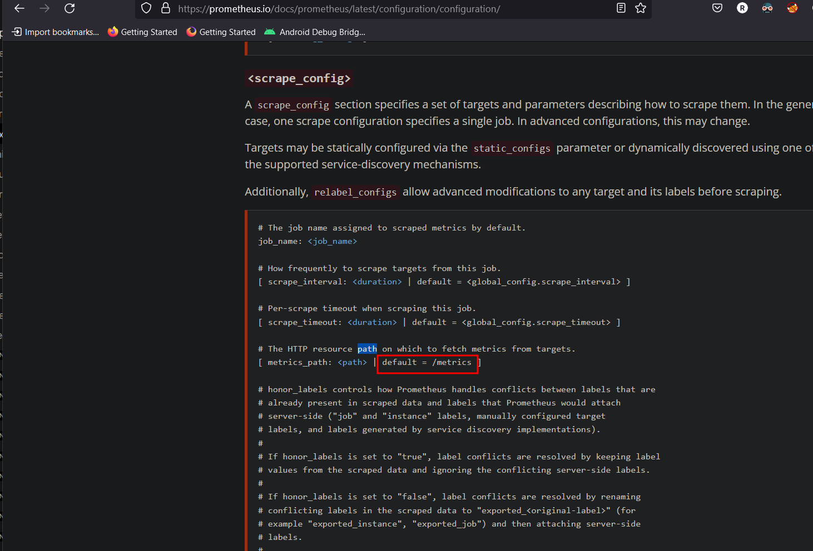

## Sensitive Data Exposure

### Challenge: Find the endpoint that serves usage data to be scraped by a popular monitoring system.

The monitoring system that scrapes for data is [prometheus](https://github.com/prometheus/prometheus) Bascially, web applications such as juice-shop can be setup to expose "data" for these monitoring applications to "collect". In this scenario, a path was exposed on this web application that reveals senstive information (to any public user) who can find this path.

Sample of sensitive info found: Server statistics such as CPU and memory related information.
```
# HELP process_cpu_system_seconds_total Total system CPU time spent in seconds.
# TYPE process_cpu_system_seconds_total counter
process_cpu_system_seconds_total{app="juiceshop"} 1.223797

# HELP process_cpu_seconds_total Total user and system CPU time spent in seconds.
# TYPE process_cpu_seconds_total counter
process_cpu_seconds_total{app="juiceshop"} 15.458678

# HELP process_start_time_seconds Start time of the process since unix epoch in seconds.
# TYPE process_start_time_seconds gauge
process_start_time_seconds{app="juiceshop"} 1648861171

# HELP process_resident_memory_bytes Resident memory size in bytes.
# TYPE process_resident_memory_bytes gauge
process_resident_memory_bytes{app="juiceshop"} 134164480

# HELP process_virtual_memory_bytes Virtual memory size in bytes.
# TYPE process_virtual_memory_bytes gauge
process_virtual_memory_bytes{app="juiceshop"} 431857664

# HELP process_heap_bytes Process heap size in bytes.
# TYPE process_heap_bytes gauge
process_heap_bytes{app="juiceshop"} 200368128

# HELP process_open_fds Number of open file descriptors.
# TYPE process_open_fds gauge
```

To solve this challenge, check in the Prometheus documentation and see that configuration instructions are by default looking for `/metrics` path to scrape info 

. 

Navigate to the path to clear this challenge.
