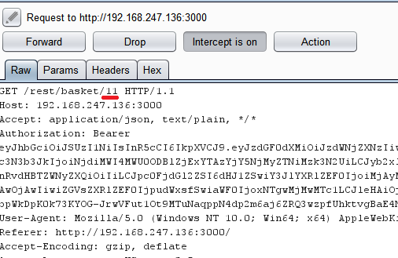

## View Basket
### Challenge: View another user's shopping basket.

I created 2 different users eg. `hacker@hacker.com` and `other_hacker@hacker.com` whose baskets have many items added to cart.

If you intercept the HTTP requests (eg. burpsuite) when clicking `Your Basket` you will notice the requests `GET /rest/basket/11` where `11` is the identifier for the user's basket.

Modify it with the user's basket identifier that you like to view and you will complete the challenge. eg. `other_hacker@hacker.com` basket id value is `12` we will modify the HTTP request in burp to  `GET /rest/basket/12` and forwarding it.