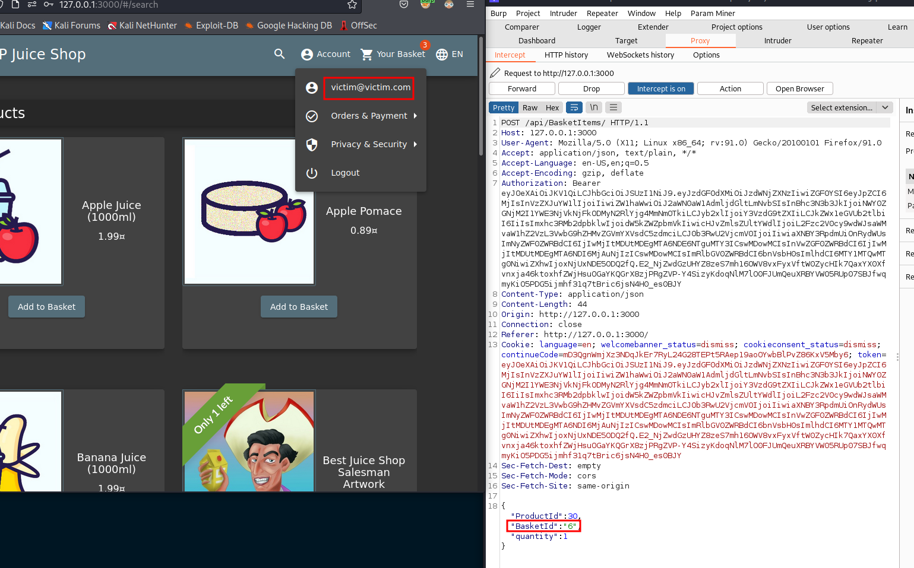
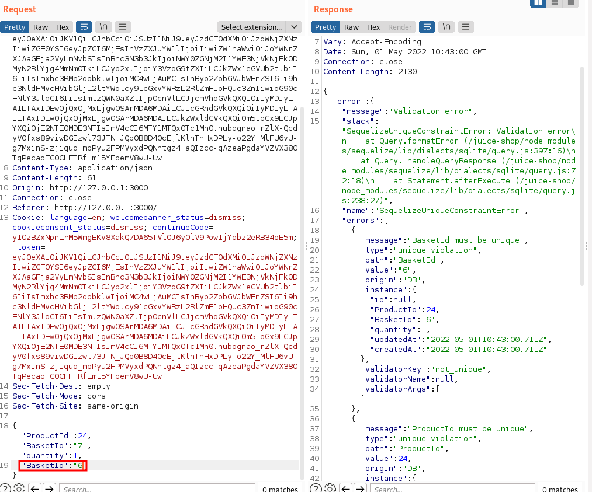

## Manipulate Basket

### Challenge: Put an additional product into another user's shopping basket.

### Category: Broken Access Control

1. Intercept request when add to basket. Observe that the user account and its associated basket ID

2. Using the attacker account, we do the same thing but add a duplicate BasketId. 

You will notice that simply changing the basketId here will not work, but the use of Duplicate `BasketId` in this case worked - this is indicative of lack of validation checks and a programmatic logic issue e.g. the code probably validates the first instance of BasketId to be valid or not. Then when we introduce another `basketId` it just updates provided the basketId. 
