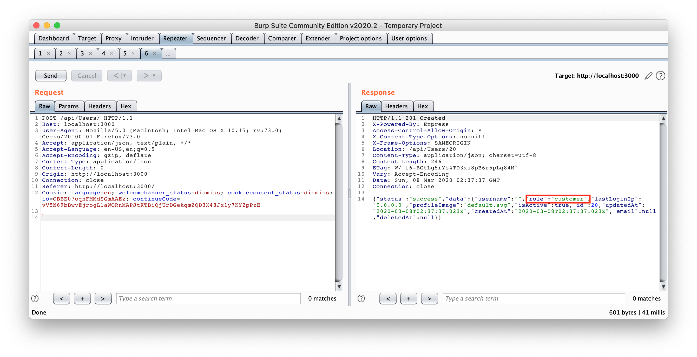
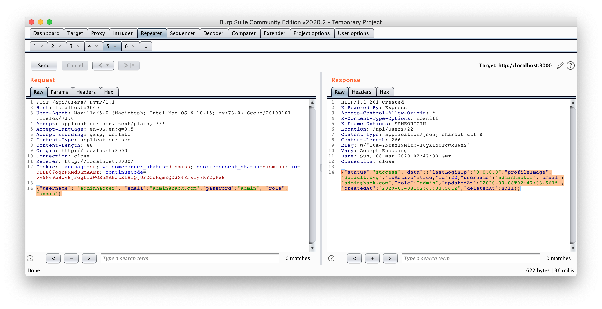

## Admin Registration
### Register as a user with administrator privileges.
### Category: Improper Input Validation

If you use burp to intercept traffic when creating a new user, you will notice that there is a rest api call made to `/api/Users` and the registration inputs are added as json parameters.

Further testing with the rest api will reveal that there is a parameter that defines `role`. Eg. Sending an empty `/api/Users` POST request with no parameters will result in the following response:

Send another `POST /api/Users/` with the following parameters 
`{"username": "adminhacker", "email":"admin@hack.com","password":"admin", "role":"admin"}`

