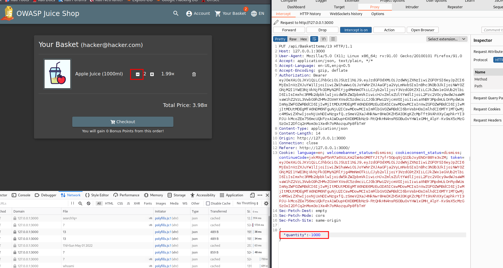
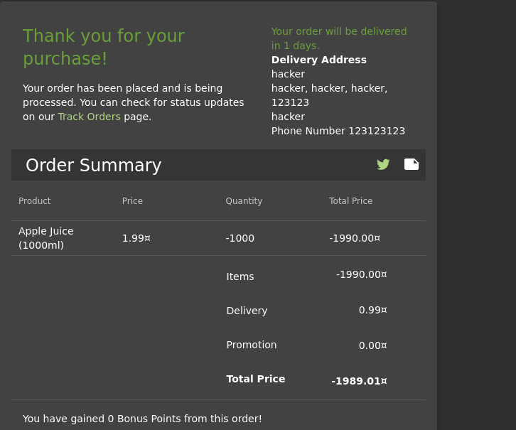

# Payback Time
## Challenge: Place an order that makes you rich.
## Category:  Improper Input Validation 

1. After placing an item in to your basket. Modify the quantity and intercept the request. Observe `quantity` and change it to a negative value

2. Proceed to payout and see that the amount payable is negative

