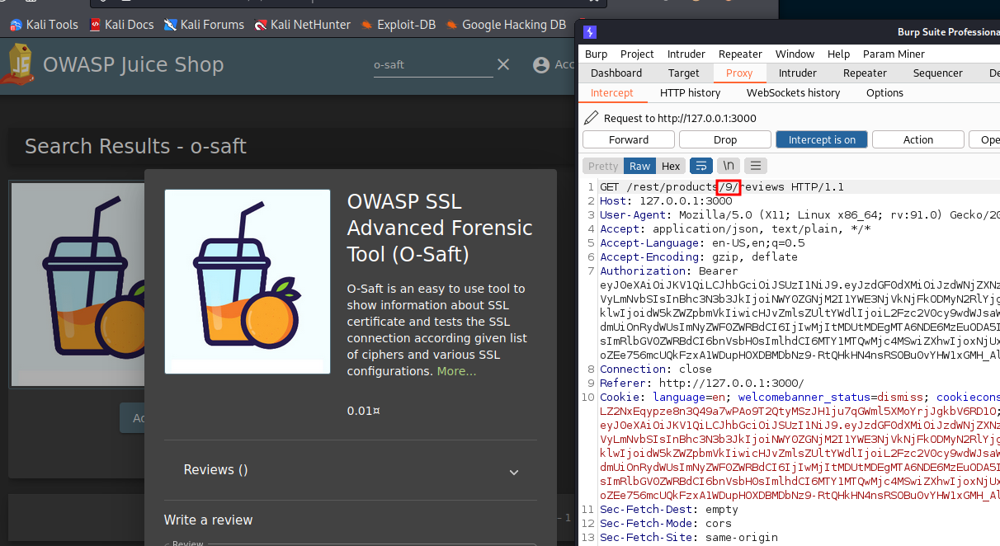
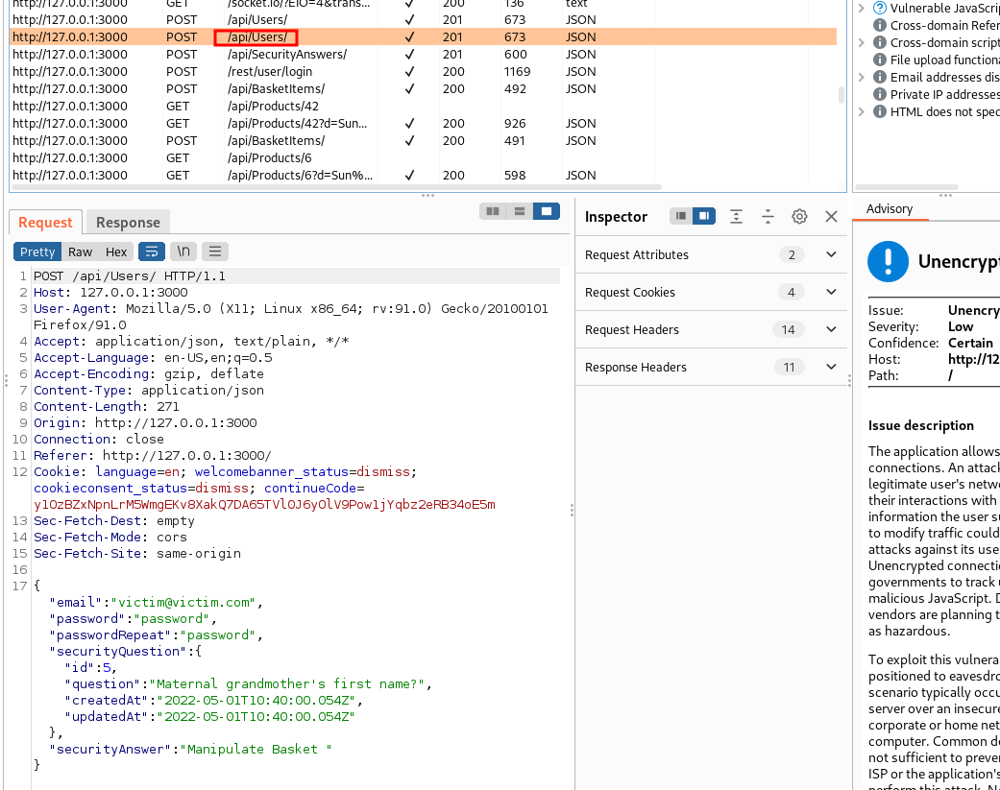
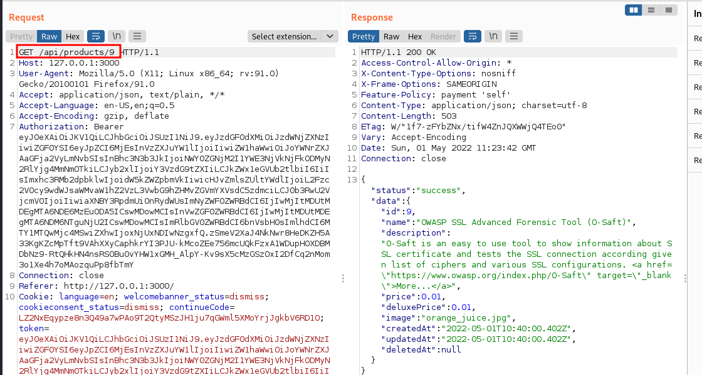
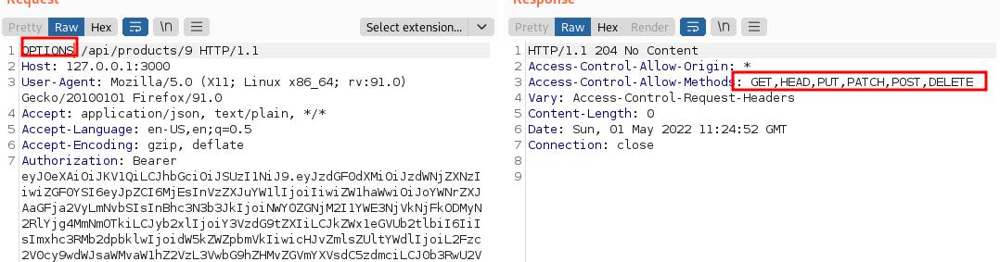
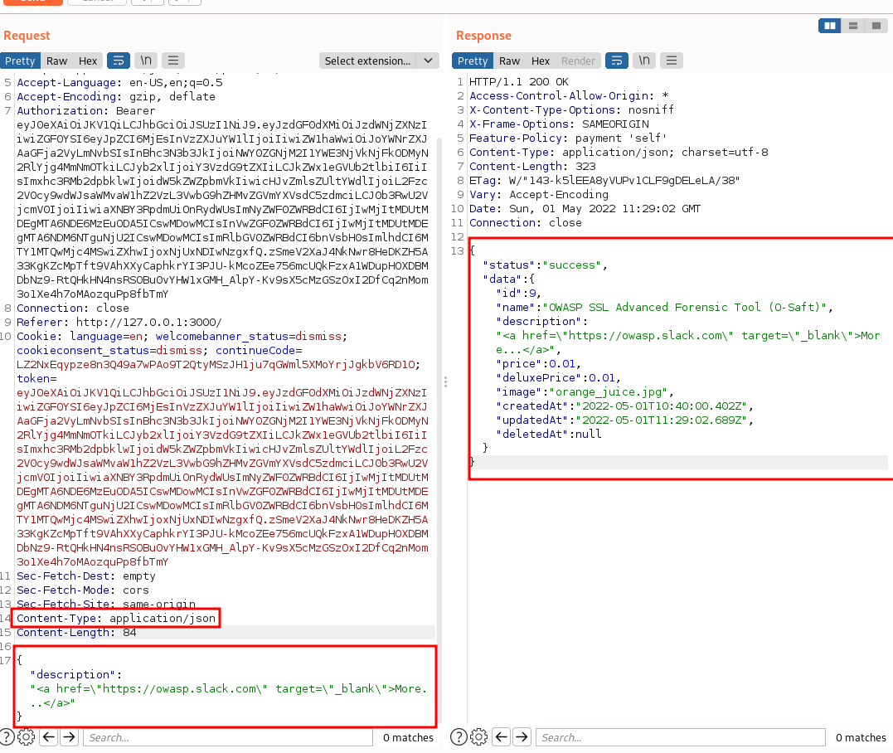

# Product tampering
## Challenge: Change the href of the link within the OWASP SSL Advanced Forensic Tool (O-Saft) product description into https://owasp.slack.com.

## Category: Broken Access Control 

1. Search 'o-saft' and observe take note of product ID



To exploit this we observe from earlier that the `/api` endoint appears to be called when creating a user




2. With some trial an error, we observe that `/api/products/<id>` returns the json data of product



3. Doing an `OPTIONS` reveals that `PUT` is allowed too




4. Modify description by sending a `PUT` request with the following description



## Code challenge
To mitigate 

```js
//app.post('/api/Products', security.isAuthorized())
app.post('/api/Products', security.denyAll())

// app.put('/api/Products/:id', security.isAuthorized())
app.put('/api/Products/:id', security.denyAll())
```