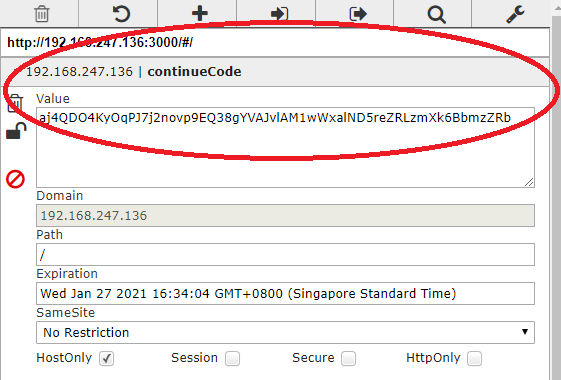

# OWASP juice shop solutions
 
 
## Setup
[https://github.com/bkimminich/juice-shop](https://github.com/bkimminich/juice-shop)
1. Install a 64bit node.js on your Windows, MacOS or Linux machine
2. Download juice-shop-<version>_<node-version>_<os>_x64.zip (or .tgz) attached to latest release
3. Unpack and cd into the unpacked folde[r]
4. Run npm start
5. Browse to http://localhost:3000

## How to save my progress?!
I had a problem of lossing my progress everytime I restarted/shutdown my juicebox. So if you are doing this at your own time and over a span of days/weeks, this may be helpful!

1. Using VM (with host-only or NAT network configurations), setup and start your juiceshop. You can then access juicebox by browsing to this VM's ip eg. `http://ipaddress:3000`
2. After you are done, save your cookie value using a cookie editor plugin eg. Chrome's **EditThisCookie** take note of the value for `continueCode`
3. Pause your VM instead of shutting them down so that you could resume progress next time.

4. To continue next time, all you need to do is just start back up the VM instance. Using your browser's cookie editor (eg. Chrome's **EditThisCookie**) and add the value for `continueCode` back.
5. Accessing your VM's ip eg. `http://ipaddress:3000` you can now pickup from where you left off!
 
## Solutions

In progress